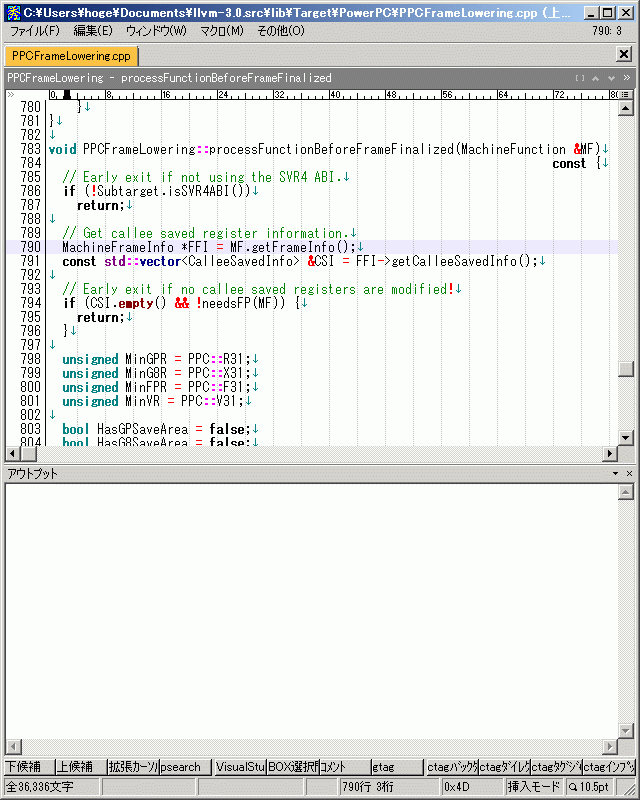
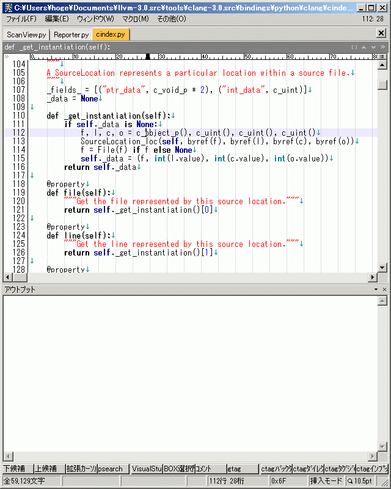
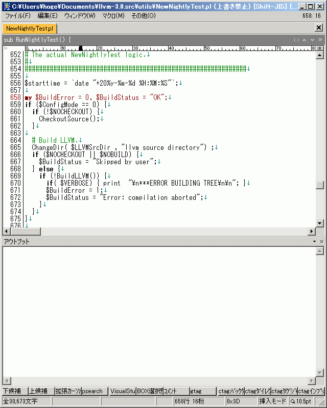
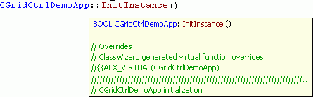

# Visual Assist Xっぽい秀丸マクロ
Visual Assist X の Hovering Tooltips っぽい秀丸マクロを途中まで書いてみました。

関数とクラスのコメントをアウトプット枠へ表示するマクロです。
コメントはTooltipsで表示したかったんですが、秀丸エディタに機能が無いためアウトプット枠へ出力しました。

# 動作イメージ

## CPP



## Python



## Perl



# ゴール
こんな感じのマクロを目指す。



# マクロの導入方法

まずは、動作確認を行った安定バージョンをダウンロードして下さい。

https://github.com/ohtorii/hidemaru_hovering_tooltips/releases

masterブランチを取得しても多分動作しないです。（動作確認を行っていないため）


## ディレクトリ構成

全ファイルとフォルダを秀丸エディタのスクリプトディレクトリにコピーしてください。

コピー後のディレクトリ構成

    hidemaru_macrodir
      └─hidemaru_hovering_tooltips
         ├─hidemaru_hovering_tooltips.mac
         ├─internal
         └─images

## ショートカットキー割り当て

`hidemaru_hovering_tooltips.mac` をショートカットキーに割り当てて下さい。

## 事前準備

このマクロでは、テキスト中の```コメントと文字列```を秀丸エディタから取得しています、そのため、事前に秀丸エディタの設定が必要です。

### 設定する箇所

- メニュー → その他 → ファイルタイプ別の設定 → 複数行コメント
- メニュー → その他 → ファイルタイプ別の設定 → 強調表示


## カスタマイズ

マクロの動作をカスタマイズするには[internal/config.ini](internal/config.ini)を参照して下さい。


# 連絡先
- https://ohtorii.hatenadiary.jp/
- https://twitter.com/ohtorii
- https://github.com/ohtorii/hidemaru_hovering_tooltips
