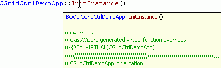

# Visual Assist Xっぽい秀丸マクロ
Visual Assist X の Hovering Tooltips っぽい秀丸マクロを途中まで書いてみました。

関数とクラスのコメントをアウトプット枠へ表示するマクロです。
コメントはTooltipsで表示したかったんですが、秀丸エディタに機能が無いためアウトプット枠へ出力しました。

# 動作イメージ
## CPP

## Python

## Perl

# ゴール
こんな感じのマクロを目指す。

# 連絡先
http://d.hatena.ne.jp/ohtorii/  
https://twitter.com/ohtorii  
https://github.com/ohtorii/hidemaru_hovering_tooltips  
