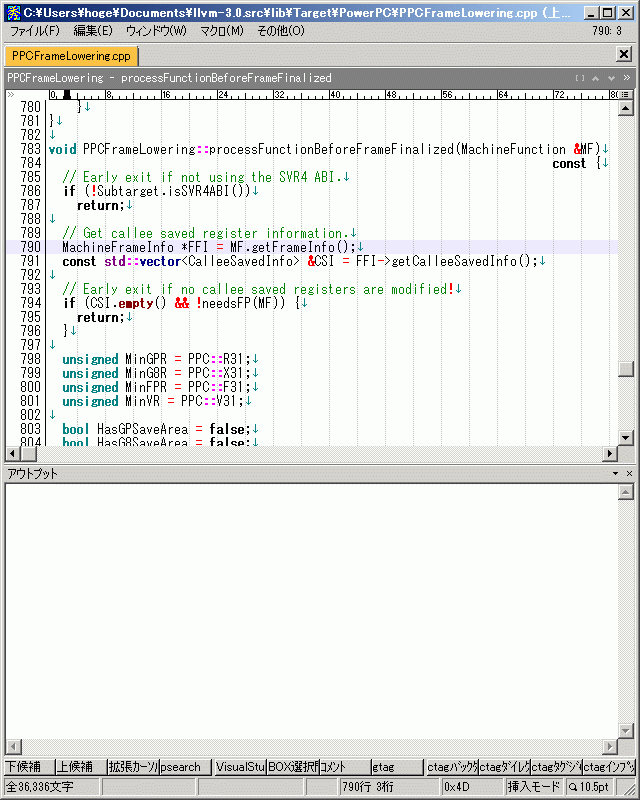
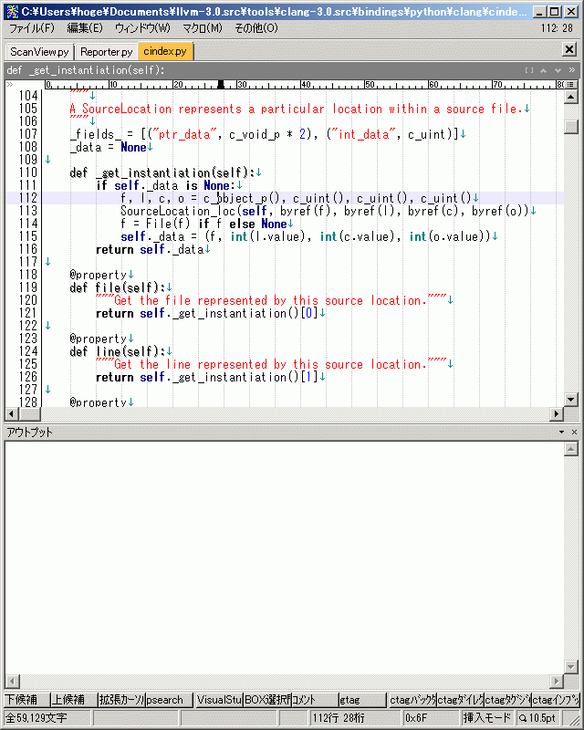
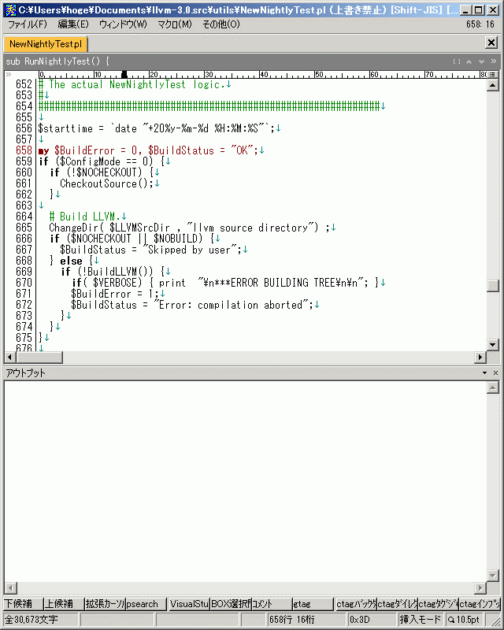

# Visual Assist Xっぽい秀丸マクロ
Visual Assist X の Hovering Tooltips っぽい秀丸マクロを途中まで書いてみました。

関数とクラスのコメントをアウトプット枠へ表示するマクロです。
コメントはTooltipsで表示したかったんですが、秀丸エディタに機能が無いためアウトプット枠へ出力しました。

# 動作イメージ
## CPP

## Python

## Perl

# ゴール
Visual Assist XのHovering Tooltipsを目指すプロジェクトです。
http://www.wholetomato.com/products/features/hover.asp

まだ、動かないです。

# blog
http://d.hatena.ne.jp/ohtorii/20120204/p1
